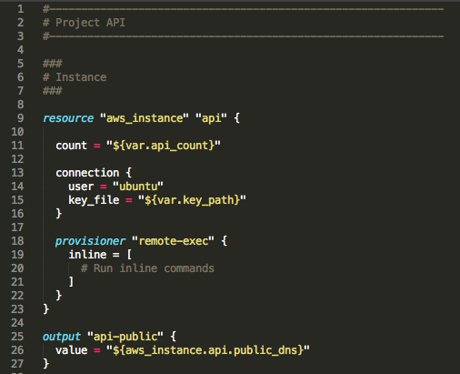

Terraform Syntax Highlighting
===============================

Basic support for Terraform's [custom .tf file type](http://www.terraform.io/docs/configuration/syntax.html)

Installation
------------

1. Using Package Control, install "Terraform" (TODO)

Or:

1. Open the Sublime Text Packages folder

    - OS X: ~/Library/Application Support/Sublime Text 3/Packages/
    - Windows: %APPDATA%/Sublime Text 3/Packages/
    - Linux (Ubuntu/Debian): ~/.config/sublime-text-3/Packages/

2. clone this repo
