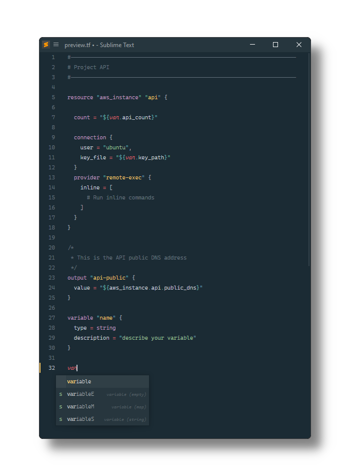

# Terraform

[Terraform][.tf] configuration file syntax definitions and snippets for [Sublime Text][].

## Installation

### Using Package Control

1. Install [Package Control][], if needed.
2. Open the palette by pressing
    <kbd>Ctrl</kbd>+<kbd>Shift</kbd>+<kbd>P</kbd> (Win, Linux) or
    <kbd>Cmd</kbd>+<kbd>Shift</kbd>+<kbd>P</kbd> (OS X).
3. Select _Package Control: Install Package_.
4. Select _Terraform_.

### Manually

1. Open the Sublime Text Packages folder:
    - MacOS: `~/Library/Application Support/Sublime Text/Packages/`
    - Windows: `%APPDATA%/Sublime Text/Packages/`
    - Linux (Ubuntu/Debian): `~/.config/sublime-text/Packages/`
2. Clone this repo.

[sublime text]: https://sublimetext.com/
[.tf]: https://developer.hashicorp.com/terraform/language/syntax/configuration
[package control]: https://packagecontrol.io/installation
